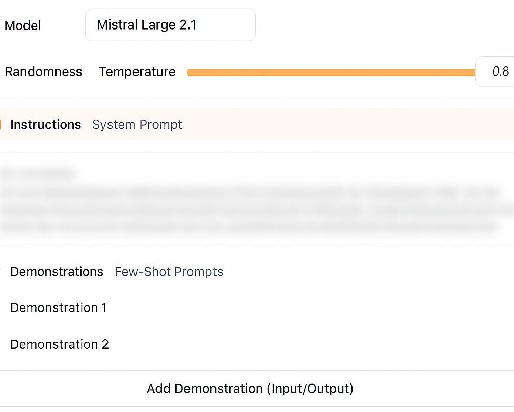

_Generate personalized cover letters from a job posting URL._

## My problem

During my job search, I sometimes needed to write cover letters. Although I enjoy crafting the right phrasing, this exercise remains quite rigid and repetitive. That's why I decided to make things easier for myself without undermining the process.

## Automate...

- **Delegate**: the low-value part of the letter / the common part shared across multiple letters
- **Save time**: allow me to focus on revision and adding value where necessary
- **Centralize**: have a place to store all generated letters
- **Test generative AI**: I saw that Mistral offered free "agents" configuration on their platform, I wanted to see what it could do
- **Have fun**: take advantage of this small project to get started with frameworks/technologies I had never touched before

## ... with some constraints

- **Easy to use**: if the process is tedious, the whole principle is void - the goal is to make life easier
- **No deployment**: even though there are simple and free ways to make the service available online, my need doesn't justify it
- **Free**: LLM usage could be expensive, so I need to find solutions that are (still) free and produce satisfactory results

## Using the browser

I wanted something simple: the goal was to save time, so avoiding dozens of clicks or context switching. I naturally turned to a web interface: the links I would retrieve would be in another tab and I would just have to copy them into my interface.

For a while, I wanted to get into React - because I had the opportunity to work with Angular and Vue, but the project size made me lean towards [Preact](https://preactjs.com/). It would be a good middle ground to get initiated into React's philosophy. To bootstrap the project, I used [Vite](https://vite.dev/) with Preact/Typescript/Tailwind.

## motivation-mate

This is how **motivation-mate** was born, a web interface that generates cover letters from job postings. Just copy the job URL and the cover letter is created automatically!

Once the page content is retrieved, a request is sent to the pre-configured Mistral agent. This is where the heart of the application lies: I had to write a precise and personalized prompt so that this "agent" could produce quality content that was completely personalized. To do this, I had to provide information that I deemed relevant to highlight in a cover letter (my background, the technologies I've used, etc.). And finally, I provided input/output pairs (job posting content / cover letters specific to that content) as examples of what I consider a satisfactory result:

The response is then saved in a text file. You can then copy its content to use or modify it.

And there you go!

## What's next

But... That wasn't enough for me. I wanted something even easier to use: this is how [gogomate](/en/projects/project-2) was born!
