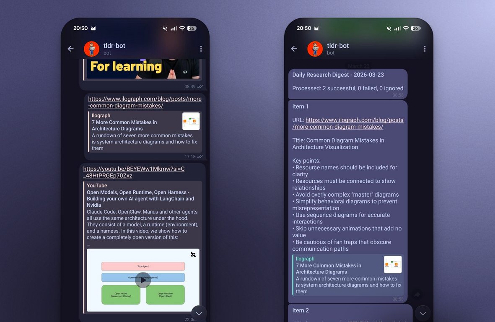
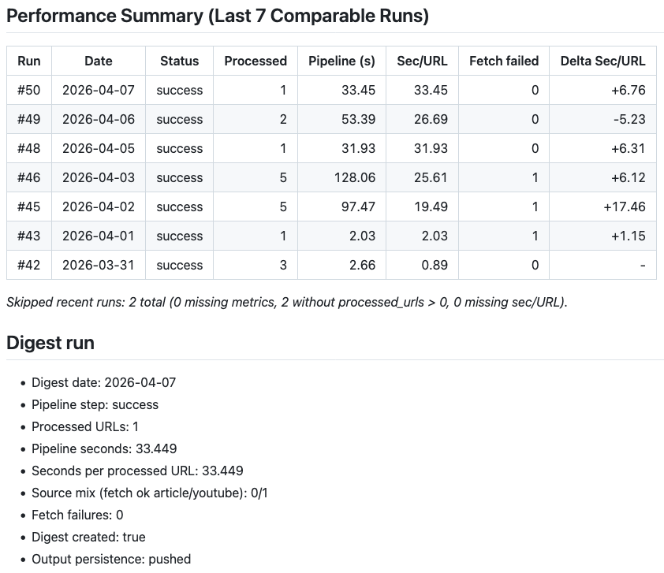

_Un digest quotidien utile. Un pipeline conçu pour rester simple à opérer._

J'ai conçu [tldr-bot](https://github.com/hame-ji/tldr-bot) à partir d'une frustration simple : je sauvegarde beaucoup de liens techniques dans la journée. Trop d'entre eux finissent oubliés sans devenir de vraies lectures.

Le besoin de départ est simple : réduire la friction au moment de la capture, puis rendre ces liens utiles plus tard. Le produit tient donc dans une boucle courte. Il suffit d'envoyer une URL dans Telegram, puis de recevoir chaque jour un digest lisible avec assez de contexte pour décider quoi approfondir et quoi ignorer.

## Contraintes utiles

Le projet tient volontairement dans un périmètre étroit :

1. Telegram pour la capture
2. GitHub Actions pour l'exécution planifiée
3. Le système de fichiers pour la persistance
4. Git pour l'historique et la traçabilité

L'exécution est serverless et suit un traitement par lots. Une fois par jour, le pipeline récupère les mises à jour Telegram, filtre les messages du chat, extrait et normalise les URLs, récupère le contenu des articles ou des PDF quand c'est possible, oriente la synthèse vers le bon service, assemble le digest puis le renvoie sur Telegram.

Il n'y a ni service toujours actif ni base de données séparée ni état dispersé entre plusieurs briques. L'ensemble reste modeste par design. En contrepartie, il gagne en lisibilité, en auditabilité et en sobriété opérationnelle.

Le point important n'est pas d'avoir fait "simple" au sens minimaliste. Le but est de borner l'ensemble pour qu'il reste proportionné au problème : capturer vite, synthétiser à heure fixe, conserver des artefacts lisibles et comprendre un incident sans reconstruire mentalement une plateforme entière.

## Arbitrages d'architecture

Le polling plutôt que les webhooks préserve la contrainte serverless. Il évite d'ajouter un point d'entrée uniquement pour collecter des liens. Un traitement quotidien par lots suffit largement ici et évite une complexité temps réel qui apporterait peu de valeur.

L'état reste dans le dépôt plutôt que dans un stockage externe. Le curseur Telegram est versionné avec le reste des artefacts. Le pipeline devient ainsi plus facile à auditer. Il est aussi plus simple à remettre sur pied quand quelque chose tourne mal.

Le chemin de synthèse est devenu plus explicite à mesure que le projet évoluait. Le flux standard des articles passe par OpenRouter quand l'extraction du contenu réussit. Les liens YouTube passent directement par NotebookLM. Certains échecs de récupération d'article y sont aussi redirigés quand c'est pertinent.

Ce découpage compte plus que le choix des fournisseurs eux-mêmes. L'objectif n'est pas d'avoir un pipeline monolithique avec une seule voie "normale" et des erreurs opaques autour. Le routage reste compréhensible : un chemin nominal quand le contenu est récupérable, un chemin alternatif quand une source se prête mieux à un autre backend et un artefact d'échec daté quand aucun des deux ne convient.

## Gestion des échecs et visibilité

L'objectif est d'assurer une bonne tolérance aux défaillances partielles. Une URL en erreur ne doit pas annuler toute l'exécution. Si une stratégie de repli permet de récupérer le cas fautif, le pipeline l'utilise. Sinon, l'échec est enregistré avec son contexte et le reste du lot continue.

Ce compromis compte plus pour moi qu'un taux de succès parfait. Une synthèse partielle mais explicite est plus utile qu'un pipeline tout-ou-rien qui s'effondre sur une seule entrée invalide.

La même logique guide l'observabilité. Plutôt que d'ajouter une infrastructure de supervision dédiée, le pipeline expose un petit contrat de télémétrie structurée via des logs comme `run_outcome` et `run_metrics`. GitHub Actions les transforme ensuite en résumés d'exécution et en historique récent.

La génération du digest reste séparée du reporting opérationnel. Le contenu ne dépend donc pas de la couche de résumé d'exécution. Si l'extraction de télémétrie ou l'historique récent tombent en panne, le chemin principal peut quand même produire et persister son résultat. Cette séparation est discrète dans l'interface, mais importante pour la robustesse de l'ensemble.

Le projet ajoute aussi une petite couche de contrôle autour des traitements dépendants de NotebookLM : vérification préalable de l'authentification avant exécution, circuit breaker en cas d'échec d'authentification et mécanisme de replay pour les échecs mis en file d'attente une fois les identifiants rafraîchis. Cela permet de contenir les incidents propres au fournisseur sans compliquer le chemin principal du digest.

Cette partie relève moins de la démo que de la discipline d'exploitation. Le pipeline vérifie ses prérequis, isole les défaillances d'un fournisseur, évite d'amplifier un incident en boucle et propose un chemin de récupération explicite une fois le problème corrigé.

La persistance reste elle aussi conservatrice : les journées vides et les exécutions sans changement sautent simplement l'étape de commit et de push. Le but n'est pas d'en faire plus mais d'éviter le bruit et de garder un historique qui correspond à de vrais événements.

## Conclusion

`tldr-bot` reste un petit système. C'est précisément son intérêt. Le périmètre est étroit, les arbitrages sont explicites et les incidents restent lisibles.

C'est le type d'outil que j'aime construire : utile au quotidien, sobre dans sa conception et assez clair pour continuer à rendre service quand une dépendance externe se dégrade.
