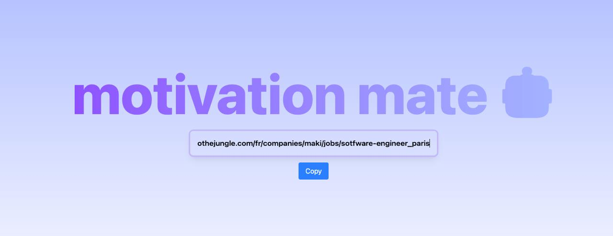

_Générer des lettres de motivation personnalisées à partir de l'URL d'une offre d'emploi._

## Mon problème

Au cours de ma recherche d'emploi, j'ai parfois eu besoin de rédiger des lettres de motivation. Bien que je prenne plaisir à trouver des formules, cet exercice reste assez rigide et répétitif. C'est pour cette raison que j'ai décidé de me faciliter la tâche sans pour autant dénigrer le processus.

## Automatiser...

- **Déléguer** : faible partie de la lettre qui a de la valeur ajoutée / la grande partie commune à plusieurs lettres
- **Gagner du temps** : me permettre de me concentrer sur la révision et l'ajout de valeur ajoutée si nécessaire
- **Centraliser** : avoir un endroit où stocker toutes les lettres générées
- **Tester l'IA générative** : j'ai vu que Mistral proposait gratuitement de paramétrer des "agents" sur leur plateforme, j'ai eu envie de voir ce que ça donnait
- **S'amuser** : profiter de ce petit projet pour m'initier à des frameworks / technologies que je n'avais jamais touchés auparavant

## ... avec quelques contraintes

- **Facile à utiliser** : si le processus est fastidieux, tout le principe est caduc - il s'agit de se faciliter la vie
- **Sans déploiement** : même s'il existe des façons simples et gratuites de rendre le service disponible en ligne, mon besoin ne le justifie pas
- **Gratuit** : l'usage de LLM pourrait coûter cher, il faut donc trouver les solutions qui sont (encore) gratuites et qui produisent des résultats satisfaisants

## Utiliser le navigateur

Je voulais quelque chose de simple : le but était de gagner du temps, donc d'éviter de faire des dizaines de clics ou de changer de contexte. Je me suis naturellement tourné vers une interface web : les liens que je récupérerais seraient dans un autre onglet et je n'aurais plus qu'à les copier dans mon interface.

Depuis un certain temps, je voulais me mettre à React - parce que j'ai eu l'occasion de travailler avec Angular et Vue, mais la taille du projet m'a fait pencher pour [Preact](https://preactjs.com/). Ce serait un juste milieu pour m'initier à la philosophie de React. Pour bootstrap le projet, j'ai utilisé [Vite](https://vite.dev/) avec Preact/Typescript/Tailwind.

## motivation-mate

C'est ainsi qu'est né **motivation-mate**, une interface web qui permet de générer des lettres de motivation à partir d'offres d'emploi. Il suffit de copier l'URL de l'offre et la lettre de motivation est créée automatiquement !

Une fois le contenu de la page récupéré, une requête à l'agent Mistral préalablement configuré est envoyée. C'est là que le cœur de l'application se trouve : il a fallu écrire un prompt précis et personnalisé pour que cet "agent" puisse produire des contenus de qualité mais surtout complètement personnalisés. Pour ce faire, il a fallu lui fournir des informations que j'ai jugées pertinentes à mettre en valeur pour une lettre de motivation (mon parcours, les technologies que j'ai utilisées, etc.). Et enfin, je lui ai fourni des couples d'input (contenu d'offre d'emploi) / output (lettres de motivation spécifiques à ce contenu) comme exemples de ce que je juge être un résultat satisfaisant :

On récupère ensuite la réponse qui sera sauvegardée dans un fichier texte. On peut ensuite copier son contenu pour l'utiliser ou le modifier.

Et voilà !

## La suite

Mais ... Cela ne m'a pas suffit. Je voulais quelque chose d'encore plus facile à utiliser : c'est ainsi qu'est né [gogomate](../../projects/project-2) !
